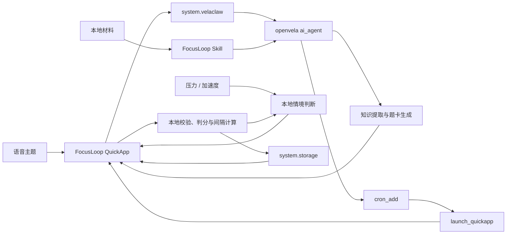

# FocusLoop 学习闭环

**队伍：博丽灵梦赛高（253）**


FocusLoop 是一款运行在 openvela 手表上的主动学习应用。用户可以直接说出学习主题，也可以导入自己的学习材料。应用把内容整理成适合腕上回答的短题，并在复习临近时结合压力和活动状态寻找更合适的提醒时机。


| 学习总览 | 专注计时 | 答题反馈 |
| --- | --- | --- |
|  |  |  |

[查看正式技术报告（官方模板 PDF）](docs/FocusLoop_Project_Report.pdf) · [查看测试证据](docs/verification/2026-09-16/summary.json)

## 要解决的问题

学习计划通常不难制定，难的是在合适的时刻真正回来复习。固定提醒不了解用户此刻正在走动、压力较高，还是刚好有几十秒空闲；聊天助手生成内容后，也很少继续跟进下一次学习。手表贴身、可读取设备状态，适合把学习任务压缩成及时、低打扰的短时行动。

FocusLoop 把一次学习拆成五步：

1. 通过语音、预设主题或本地材料创建学习计划；
2. Agent 提取知识点，生成带解释的三选一短题；
3. 完成 15、25 或 40 分钟的单任务专注；
4. 专注结束后立即答题，更新每张词卡的学习状态；
5. 到期任务由系统主动拉起应用；开启智能推荐后，低压力且静止的临近复习也会在腕上提示。

智能推荐默认关闭，由用户在“智能复习窗口”中主动开启。当前实现使用实时压力和加速度变化判断短时复习窗口；用户选择“开始复习”或“稍后”后，本地规则会逐步调整个人压力阈值和展示接受率。答错后 10 分钟重试；连续答对后，复习间隔从 1 天、3 天逐步增加，最长 30 天。模型服务暂时不可用时，内置题目会接管，计时、答题和进度保存仍可使用。

## 技术实现



- **QuickApp 界面**：学习总览、计划、专注、答题和智能复习窗口针对 466×466 圆形表盘设计，每页只保留一个主要动作。
- **内容理解**：Agent 将主题或导入材料整理成知识点、题目、选项、简短解释和材料依据；结构化结果经过字段、长度和答案索引检查后才会写入学习计划。
- **语音输入**：QuickApp 通过现有 `system.velaclaw` 消息桥控制 `ai_agent` 的 PTT/ASR，应用只接收识别后的主题文本。
- **本地材料导入**：`.txt` 或 `.md` 文件进入设备本地收件箱后，由 FocusLoop Skill 限定路径读取并生成 3–8 张词卡。
- **智能复习窗口**：用户主动开启后，应用级监测器订阅压力和加速度；本地规则只在低压力、静止、复习临近且冷却时间结束时推荐，并根据“开始复习 / 稍后”反馈调整个人阈值。
- **本地学习逻辑**：答题评分、复习间隔、到期题目选择和进度计算都在本地完成，结果可测试、可恢复。
- **主动唤起**：`cron_add` 创建一次性任务，时间到达后由 `launch_quickapp` 打开 FocusLoop。
- **异常处理**：模型输出会经过字段、长度、选项数量和答案索引检查；请求超时后自动切换到离线计划。

更详细的模块说明见 [docs/ARCHITECTURE.md](docs/ARCHITECTURE.md)。

## 完成情况

- 五页 QuickApp 学习流程已完成；
- FocusLoop Skill 与 `system.velaclaw` 调用已完成；
- 2026-09-16 复测：28 项逻辑与集成约束测试，连续 20 轮共 560 项检查无失败；
- Windows AIoT Toolkit 连续 5 轮构建通过，已提交 debug RPK 为 72,703 字节；
- 生产依赖漏洞为 0；RPK 和 SHA-256 已放入 `artifacts/`；
- openvela Goldfish 系统 3561 个目标完整构建通过；
- 在 `xiaomi_watch_s1` 466×466 Goldfish 中完成页面导航、离线计划、专注、答题、间隔更新和本地存储验证；
- Goldfish 中已验证 QuickApp 请求进入 `ai_agent`、Agent 计划保存和离线回退；新增语音控制桥已通过 Goldfish 完整链接。
- 智能复习窗口使用大赛健康接口定义，并对不支持 `service.health` 的设备保留独立降级状态；健康接口真机运行仍需在 miwear 镜像中验收。
- 开发侧提供 `focusloop-verify` Skill，可一键检查测试、构建、依赖、RPK、疑似凭证和交付文案。

逐轮命令输出、退出码和用时见 [验证证据](docs/verification/2026-09-16/summary.json)；范围为宿主机测试与构建，不代表手表功耗、模型延迟或 ASR 准确率。复测命令：

    node scripts/collect_verification.cjs

正式报告直接填写官方 Word 模板，保留信息表、摘要与 3.1–3.7 章节，并导出为 PDF。正文位于 docs/report/template-content.json，在 Windows / Microsoft Word 环境执行：

    .\scripts\build_official_report.ps1 -Template .\docs\report\official-submission-template.docx

## 导入学习材料

支持 UTF-8 编码的 `.txt` 和 `.md` 文件，单个文件不超过 64 KB。连接模拟器或设备后执行：

```bash
./scripts/import_focusloop_material.sh docs/samples/openvela-study-material.md
```

随后在计划页点击“导入材料”。Agent 只读取 `/data/ai_agent/focusloop/import.txt`，并根据文件内容生成词卡。

## 快速构建

需要 Node.js 16 或更高版本：

```bash
cd quickapp/focusloop
npm install
npm test
npm run build
```

构建产物：

```text
quickapp/focusloop/dist/com.openvela.focusloop.debug.0.1.0.rpk
```

仓库同时保留已核对的参赛制品：`artifacts/FocusLoop-0.1.0-debug.rpk`。

使用 AIoT Toolkit 虚拟设备调试：

```bash
npm start
```

## Goldfish 联调

在 Ubuntu 22.04 的 openvela 工作区根目录执行：

```bash
./contest2026_253_bolilingmengsaigao/scripts/build_goldfish_ai.sh
./emulator.sh cmake_out/vela_goldfish-arm64-v8a-ap/
```

另开终端部署应用、Skill 和 Goldfish 中文字体：

```bash
OPENVELA_WORKSPACE="$PWD" \
  ./contest2026_253_bolilingmengsaigao/scripts/deploy_focusloop.sh
```

随后按照 openvela `ai_agent` 文档配置模型服务并启动 Agent。

## 五分钟演示

1. 用语音说出学习主题，生成一组带解释的短题；
2. 导入示例材料，展示 Agent 基于用户内容生成词卡；
3. 完成一次专注和答题，展示学习状态更新；
4. 开启智能复习窗口，展示低压力、静止状态下的短时复习推荐；
5. 使用“60 秒提醒”，展示 Agent 到时主动打开 FocusLoop；
6. 关闭模型服务，再创建计划，展示离线流程仍可使用。

完整讲解词见 [docs/DEMO_SCRIPT.md](docs/DEMO_SCRIPT.md)。

## 项目目录

```text
quickapp/focusloop/          QuickApp 源码、测试与构建配置
agent_skills/focusloop.md    FocusLoop Skill
scripts/                     Goldfish 构建和部署脚本
docs/                        架构、演示脚本、报告与运行截图
artifacts/                   已核对的 RPK 与 SHA-256
```

FocusLoop 可以用于语言学习、认证备考和企业微课。用户或课程方提供学习材料，Agent 负责整理知识与执行任务，手表负责在更合适的时刻承接一次短时回忆。

本项目采用 [Apache License 2.0](LICENSE)。
